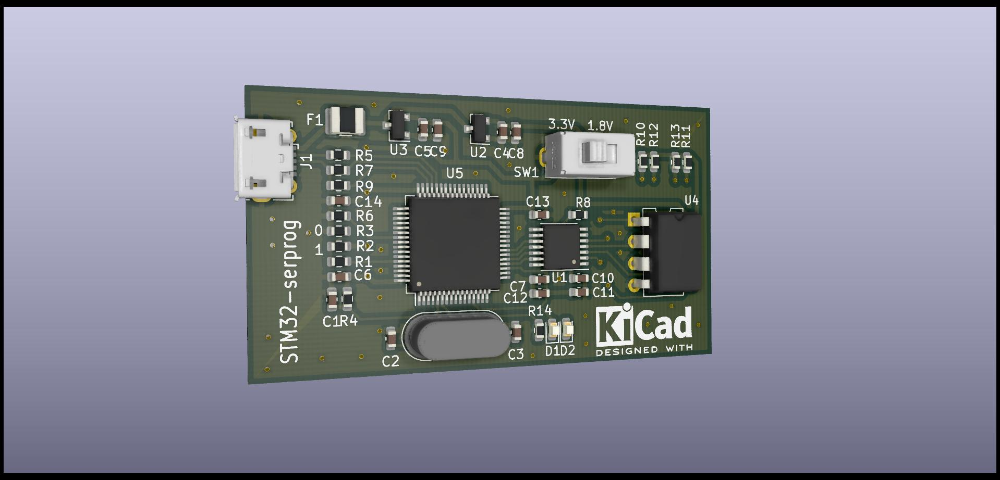

# STM32-serprog

## 概述

本项目是flashrom工具serprog编程器的一种实现，参考了[dword1511/stm32-vserprog](https://github.com/dword1511/stm32-vserprog)中v3版本电路原理图，增加了电平转换芯片用来同时支持1.8V和3.3V的spi flash，可以直接使用该仓库中的代码，经测试可以正常工作，PCB效果图如下。

## Changelog

* v0.2 (该版本未发板验证，不过原理图整体改动不大，应该没有问题)
    * 删除了多余的测试点
    * 将txs0108修改为txs0104/txb0104，节约成本

* v0.1
    * 第一个版本，已打板验证
